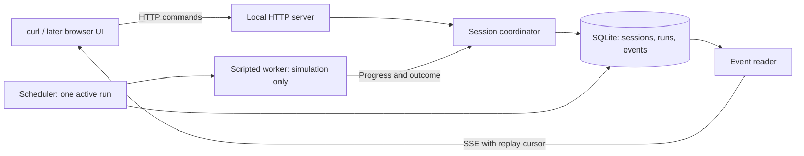
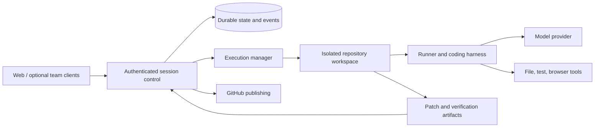

# Architecture: learn the lifecycle, then add execution

Status: proposed, September 18, 2026. The user's direction is to begin with simple building blocks, without requiring an AI agent or remote computer. This document explains the reference and proposes a smaller starting point.

## 1. What we are building

The eventual product accepts a coding task, prepares a workspace, runs a coding agent, retains evidence of its work, and presents a reviewable change. Its execution is independent of whichever client submitted the task.

We build the orchestration ourselves: session history, scheduling, progress delivery, recovery, and the user's workflow. We can later reuse an existing harness for model/tool execution. Reimplementing a harness is a separate learning project, not a prerequisite for understanding background agents.

The first version teaches orchestration with a scripted worker. It does not edit a repository, call a model, or create a pull request.

## 2. What the sources establish

Ramp calls its system Inspect. Its January 12, 2026 post describes a background coding system with development environments, verification tools, persistent sessions, and multiple clients. It reports approximately 30% of merged frontend/backend PRs being written by Inspect at that time, not all company PRs. This is a historical adoption claim, not a target or verified current figure. [Ramp post](https://engineering.ramp.com/post/why-we-built-our-background-agent).

The detailed names and wiring below come from the **user-supplied diagram**. Treat that diagram as a reference design; its provenance does not establish that every label describes Ramp's current internal implementation.

| Reference module | Responsibility in the supplied diagram | First-build treatment |
| --- | --- | --- |
| React client and React Query | Display sessions and maintain client-side views | Begin with HTTP clients; add a small browser interface next |
| Cloudflare Worker | Receive requests and route them to session logic | One local Node server |
| SessionAgent Durable Object | Own one session's messages, questions, and persistent state | Session coordinator backed by SQLite |
| EventBus Durable Object | Fan out updates and notifications across users | Omit; each client reads its session's event stream |
| D1 | Global metadata, users, integrations, memories | Local session/run tables; no users or memory system yet |
| R2 | Store screenshots, uploads, and assets | Omit until real artifacts exist |
| Modal Python backend | Create, inspect, and retire sandboxes from images | Omit until isolated execution is introduced |
| Modal Dict and Queue | Coordination/image bookkeeping and prompt delivery | SQLite queue is the single scheduling authority |
| Sandbox runner | Bridge orchestration and the agent harness | Scripted worker called inside the local server |
| OpenCode server | Execute the coding conversation and tools | Deferred harness candidate |
| code-server, ttyd, VNC | Let people inspect/edit code and interact with a desktop | Defer all three; none is required for the lifecycle lesson |
| GitHub, Slack, Linear | Publish changes and connect team workflows | GitHub later; Slack/Linear only after a demonstrated need |
| Postgres, Redis, Temporal, RabbitMQ inside images | Dependencies of the application being worked on | Install only what a future target repository needs |

The last row matters: dependencies inside a target application's sandbox are not automatically dependencies of our orchestration system.

## 3. Read the large diagram as a task journey

1. A person submits a prompt through a client.
2. The request reaches the control layer, which records the session and queues work.
3. The execution layer prepares an environment with a repository and development tools.
4. A runner sends the instruction to the harness and translates its progress into session events.
5. The harness repeatedly obtains model output, invokes tools, and incorporates the results.
6. The client observes progress. Closing it does not cancel execution.
7. The system retains the result and verification evidence. Publishing a change is a separate action with its own outcome.
8. A follow-up uses the same session, potentially with a restored or replacement environment.

This is our interpretation of the supplied architecture, not a claim that the diagram specifies all retry, durability, or authorization behavior.

## 4. Clarifications before implementing the reference

**The SDK belongs on the client side of the harness.** The runner should use `@opencode-ai/sdk` to call the OpenCode server; the server performs model-provider interactions. Its event transport is SSE. The runner can translate those events into a different transport for the control layer. See [OpenCode server](https://opencode.ai/docs/server/) and [SDK](https://opencode.ai/docs/sdk/).

**A broadcast is not persistence.** Losing a WebSocket must not lose an accepted prompt or the canonical result. A later distributed design needs a durable event log, replay cursors, and idempotent ingestion regardless of whether it uses Durable Objects.

**Choose one owner for scheduling.** A queue in Modal and a second queue in session storage would need explicitly defined authority. Our proposed first build has exactly one queue in SQLite; timers merely wake the scheduler.

**Do not duplicate progress through unrelated channels.** The supplied diagram has WebSocket progress and HTTP callbacks. A future implementation must distinguish their event types or deduplicate them by identity. Otherwise the UI can show duplicated tool calls or a completed run can regress to running.

**Filesystem recovery is not process recovery.** If we later use filesystem snapshots, we must restart the harness and development processes and restore their persisted context. Snapshot expiry and checkpoint consistency must be explicit. Modal distinguishes filesystem, directory, and memory snapshots; those are not interchangeable. See [Modal snapshots](https://modal.com/docs/guide/sandbox-snapshots).

**Transport configuration affects operations.** If we adopt Durable Objects, have runners initiate connections to them; outgoing WebSockets from a Durable Object do not hibernate. Persist state needed after wakeup. See [Cloudflare WebSockets](https://developers.cloudflare.com/durable-objects/best-practices/websockets/).

**Human and agent edits need coordination.** Adding an editor to the same workspace requires a pause/ownership rule or a reconciled editing model. It is not solved simply by putting code-server in an iframe.

## 5. First-build architecture

Everything except the client and database file lives in **one Node process**. The scripted worker is an asynchronous function, not another deployment or operating-system process. It must yield during delays so HTTP requests remain responsive.

SQLite contains the queue. The scheduler claims a queued run transactionally, executes its scripted steps, and records its outcome. No Redis, external broker, cloud function, or in-memory-only task queue is required.

The app is local and single-user. It continues when a browser tab closes. It does **not** keep running through laptop sleep, process termination, or power loss. After restart, accepted prompts and recorded events remain, while in-flight runs become `interrupted` and need an explicit retry.

### Module interfaces

| Module | Small interface | Complexity kept inside |
| --- | --- | --- |
| Session coordinator | Create session; submit, cancel, retry; read session | Validation, state transitions, transactions, event ordering, idempotency |
| Scheduler | Start and stop | Queue selection, single active run, restart recovery, worker cancellation |
| Scripted worker | Execute run with cancellation and event emitter | Repeatable success/failure scenarios and step timing |
| Event reader | Read events after a cursor | Bounded reads, reconnects, stream delivery, slow-client handling |
| HTTP transport | Routes described in the first-build spec | HTTP validation and status codes, SSE framing, localhost restrictions |

Keep these as directories/functions in one application. Do not create generic provider frameworks, a plugin system, or empty cloud adapter packages. Introduce a harness seam when a real harness joins the scripted worker, and a sandbox seam when execution actually moves out of process.

### Ownership rules

- The coordinator is the only code allowed to change run lifecycle state.
- SQLite is authoritative for accepted commands, queue order, state, and events.
- The worker reports facts; it cannot authorize publishing, retry itself, or create sessions.
- The UI is a projection. It never decides that a run finished based on silence or disconnected transport.
- Success in simulation means the script finished. Later, a finished agent turn, passing verification, a published PR, and a merged PR are separate facts.

## 6. How this grows

This is a capability map, not a promise of a particular cloud stack. The upgrade path is:

1. Make sessions, runs, and recovery understandable locally.
2. Add a UI to expose that behavior.
3. Add a real harness against a disposable learning repository.
4. Add remote isolation and checkpoints when code execution leaves the trusted local exercise.
5. Add PR publishing and team access with distinct permissions.

A durable session must not be identified by a sandbox ID. When an environment expires, its replacement still belongs to the original session. Similarly, retries create new runs so failed attempts remain inspectable.

Cloudflare + Modal remains an option at step 4. A continuously running backend with a database and isolated workers is another. We should decide after measuring deployment constraints, concurrency, recovery requirements, and the cost of operating each option. No cloud migration is automatic or costless.

## 7. Trade-offs chosen for the learning build

| Choice | What it simplifies | Deliberate limitation |
| --- | --- | --- |
| One process | Local setup and tracing a request through the code | Process failure stops execution |
| One active run globally | Queue behavior and cancellation | Independent sessions cannot execute concurrently yet |
| SQLite | Transactions and persistence without a database server | Single-host operation |
| HTTP commands + SSE observations | One-way progress delivery and cursor-based reconnect | No bidirectional live editing/presence |
| Explicit retry after interruption | Avoids silently repeating future side effects | User must choose to retry |
| Scripted worker | No model cost or nondeterminism while learning | Demonstrates orchestration, not coding ability |

The first-build spec is intentionally detailed only for this stage. The [roadmap](roadmap.md) identifies design gates for later stages so we do not confuse a learning demo with production readiness.
