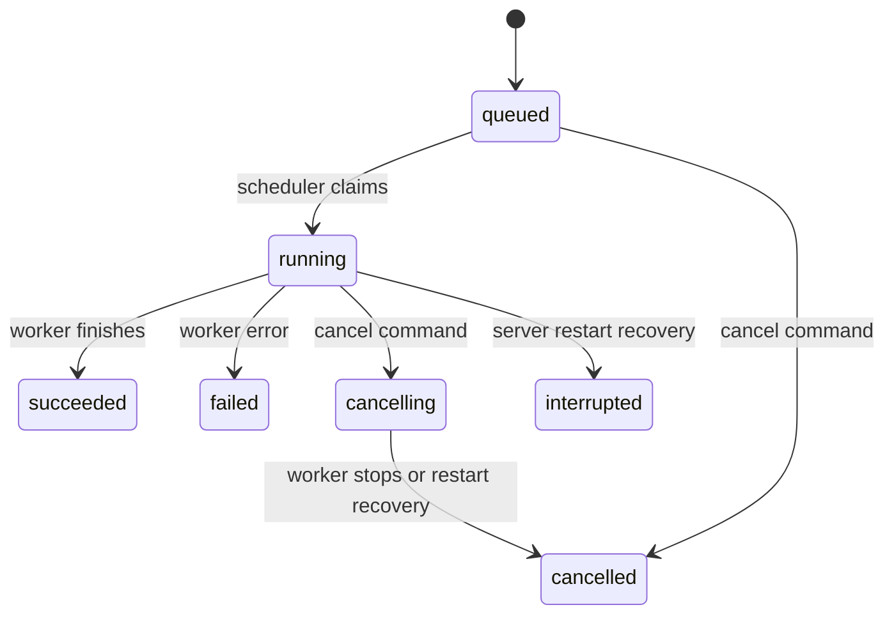

# Spec: durable session foundation

Status: proposed first implementation. Planning does not authorize provisioning or publishing. This spec follows the user's preference for simple building blocks before a coding agent or remote environment.

## Objective

Build a local, single-user application that accepts prompts, executes predictable simulated work in the background, records progress, and exposes it through HTTP and a resumable event stream.

By the end, the user should be able to explain where a task lives, who executes it, why closing a client does not stop it, what survives restart, and how failures differ from successful completion.

### User stories

- I can create a session and submit an instruction without waiting for execution to finish.
- I can follow progress and reconnect without losing recorded history.
- I can submit more work while a run executes and see queue order.
- I can cancel queued or active work.
- I can see an honest failure or interruption and explicitly retry it.
- I can distinguish simulated progress from actual AI work.

### Scope

F1 delivers the server and scripted worker, usable with `curl`. F2 adds a small browser interface. Neither phase needs model keys, a target repository, shell execution, cloud infrastructure, GitHub, authentication accounts, artifacts, or a remote desktop.

Prompts in this version are independent simulation inputs. A queued follow-up demonstrates scheduling; it does not inherit a real code workspace or model conversation.

## Tech stack

Use one TypeScript application with npm and an on-disk SQLite database. Keep the HTTP server and scheduler in the same process.

| Item | Proposed baseline | Reason |
| --- | --- | --- |
| Node.js | 24 LTS | Supported runtime for server and tests |
| TypeScript | 6.0.x; exact patch pinned in F0 | Explicit command/event contracts and strict checks |
| Express | 5.x; exact patch pinned in F0 | Small HTTP routing layer |
| better-sqlite3 | 13.0.3 candidate; validate in F0 | Explicit SQL transactions without an ORM |
| npm | Version bundled with Node 24 | One package manager and lockfile |
| Tests | Built-in `node:test` and `node:assert/strict` | Avoid a separate test framework for the foundation |
| Browser UI, F2 | HTML, CSS, browser JavaScript, native EventSource | Expose the lifecycle before choosing a frontend framework |
| Formatting/linting | Prettier and ESLint with TypeScript support; exact versions selected in F0 | Automated consistency |

These are design baselines, not an installed or tested set. [Node](https://nodejs.org/en/about/previous-releases), [TypeScript](https://www.typescriptlang.org/docs/handbook/release-notes/typescript-6-0.html), [Express](https://expressjs.com/en/5x/api/), and [better-sqlite3](https://github.com/WiseLibs/better-sqlite3/releases) provide the version references. F0 must verify macOS/Linux installation, pin direct dependencies without floating ranges, and commit `package-lock.json`. Do not claim setup is reproducible until a clean `npm ci` succeeds.

React can be introduced when UI complexity warrants it. It is not needed to teach persistence and background execution.

## Commands

**Proposed command contract; these commands are not available in the current documentation-only repository.** F0 must implement scripts with these meanings. Commands run from the repository root.

| Command | Required behavior |
| --- | --- |
| `npm ci` | Install the committed dependency set |
| `npm run dev` | Watch and run the TypeScript entry; later bind `127.0.0.1:3000` |
| `npm run build` | Compile to `dist/`; include static UI assets once F2 exists |
| `npm start` | Run the compiled server and scheduler |
| `npm run db:migrate` | Apply versioned SQLite migrations to the configured file |
| `npm run typecheck` | Check strict TypeScript without emitting files |
| `npm run lint` | Lint server, tests, and browser code |
| `npm run format:check` | Check formatting |
| `npm test` | Build test code and run unit/integration tests with Node's test runner |
| `npm run test:e2e` | Launch a child server with a temporary DB and exercise HTTP/restart scenarios |
| `npm run demo:seed` | Create labeled simulation sessions in the local app without deleting existing data |

Default configuration: `HOST=127.0.0.1`, `PORT=3000`, `DATABASE_PATH=./.data/sessions.sqlite`, `WORKER_MODE=simulated`. Support one server/scheduler per database file; multi-process access is outside this stage's deployment contract. Document this limitation and fail if the server port is already owned before performing startup recovery.

## Project structure

Planned layout; only documentation exists today:

```text
src/
  server.ts                 # Composition and startup/shutdown ordering
  config.ts                 # Validated local configuration
  sessions/
    service.ts              # Command handling and lifecycle ownership
    types.ts                # Commands, state, event payloads
  storage/
    database.ts             # SQLite connection and transaction helpers
    migrations/             # Versioned schema changes
    session-store.ts         # Explicit SQL, durable queue and event reads
  execution/
    scheduler.ts            # Claim one run, execute, record result
    scripted-worker.ts      # Success/failure simulation and abort handling
  http/
    routes.ts               # HTTP contracts and error mapping
    event-stream.ts         # SSE cursor reads and backpressure
  web/                      # F2 browser interface served by the same app
tests/
  unit/                     # Lifecycle and worker behavior
  integration/              # Real temporary SQLite files and HTTP routes
  e2e/                      # Server process, restart, disconnect scenarios
scripts/                    # Demo seed and development helpers
.data/                      # Local DB; ignored by Git
docs/                       # Architecture, specs, reference, roadmap
CONTEXT.md                  # Domain vocabulary
```

## Functional requirements

| ID | Requirement |
| --- | --- |
| FR-01 | Create and list sessions; fetch a session's prompts and runs in stable order |
| FR-02 | Persist a submitted prompt and its first queued run before returning success |
| FR-03 | Retrying a command with the same idempotency key returns the original result; changed input with that key is a conflict |
| FR-04 | Execute at most one run globally, in committed queue order |
| FR-05 | Persist lifecycle transitions and corresponding events in the same transaction |
| FR-06 | Stream recorded events with a monotonically increasing per-session cursor |
| FR-07 | A disconnected client cannot cancel a run; reconnect can replay missed events |
| FR-08 | Cancel queued work immediately; active work enters `cancelling` and cooperatively stops |
| FR-09 | On restart, running work becomes `interrupted`; persisted cancellation becomes `cancelled`; no in-flight run restarts silently |
| FR-10 | Retry creates a new run for the same prompt, linked to its prior attempt |
| FR-11 | Provide deterministic `success`, `failure`, and `slow` simulation scenarios |
| FR-12 | Display simulation mode and distinguish queue, execution, transport, and failure status |

## Data model

Use UUIDs for public identities, UTC timestamps for display/audit, and integer sequence numbers for ordering. Never order the queue by timestamps alone.

| Table | Minimum fields and constraints |
| --- | --- |
| `sessions` | `id`, `title`, `created_at`, `updated_at`, `next_event_seq` |
| `prompts` | `id`, `session_id`, `text`, `author_id='local-user'`, `created_at` |
| `runs` | `id`, `prompt_id`, `session_id`, unique integer `queue_order`, `attempt`, nullable `retry_of`, `scenario`, `status`, timestamps, nullable `error_code` and `summary` |
| `events` | `session_id`, `seq`, nullable `run_id`, `type`, `schema_version`, `payload_json`, `created_at`; primary key `(session_id, seq)` |
| `commands` | `scope`, `idempotency_key`, canonical request hash, original response status/body; unique `(scope, idempotency_key)` |

Enable foreign keys. Use short transactions, WAL, and a durability setting appropriate for acknowledged commands (initially `synchronous=FULL`). Never hold a transaction open across a worker delay or network operation.

Store a command receipt in the same transaction as its domain changes. Scope includes operation and resource, so a key for prompt submission cannot accidentally replay a cancellation response. Keep command receipts and events for the life of this local demo; introduce retention together with replay-expiry behavior later.

Every retry increments the attempt for its prompt. A prompt may have only one nonterminal run at once. A session has no independent persisted “running” flag: the UI derives activity from its runs to avoid contradictory state.

## Lifecycle and scheduling



`queued`, `running`, and `cancelling` are nonterminal. All other states are terminal. Retry creates another `queued` run; it never changes the old run back to running.

The scheduler wakes after submission and periodically checks the durable queue so a missed in-memory wakeup cannot strand work. Claim the oldest queued run and record `run.started` transactionally. The single scheduler awaits its terminal outcome before claiming another.

Startup order: validate configuration, claim the listening port without serving application requests yet, open/migrate storage, perform recovery, then enable requests and scheduling. For every recovered `running` run, persist `run.interrupted`; for every recovered `cancelling` run, persist `run.cancelled`. Previously queued work can then execute. This is safe for independent scripted prompts; the real-agent milestone must revisit dependent follow-ups and ambiguous tool effects.

Cancellation/completion races are resolved by the first committed transition. If completion commits first, cancellation returns the existing terminal state. If cancellation commits first, ignore later success reports and finish as cancelled. Progress from a terminal run must be rejected.

On graceful shutdown, stop claiming work, request cancellation for the active run, give it a bounded shutdown window, and record its outcome if possible. An abrupt kill is handled on next startup. Cancellation of one run does not remove other queued runs.

## HTTP and event contracts

All bodies and responses are JSON except the SSE stream. IDs in the routes below refer to this application's domain, not a future harness's identifiers.

| Method and route | Request / response |
| --- | --- |
| `GET /health` | `200` with readiness and `mode: simulated` |
| `POST /api/sessions` | `{title}` → `201` with session; requires `Idempotency-Key` |
| `GET /api/sessions?limit=50&after=<id>` | Stable creation order, maximum 100 per page |
| `GET /api/sessions/:id` | Session with ordered prompt/run summary and `lastEventSeq`, read in one consistent transaction |
| `POST /api/sessions/:id/prompts` | `{text, scenario}` → `202` with prompt and queued run IDs; requires `Idempotency-Key` |
| `POST /api/runs/:id/cancel` | Empty object → `200` with current run; requires `Idempotency-Key` |
| `POST /api/runs/:id/retry` | Empty object → `202` with a new run; requires `Idempotency-Key` |
| `GET /api/sessions/:id/events?after=0&limit=100` | Ordered durable events and last returned cursor; maximum 500 per page |
| `GET /api/sessions/:id/stream?after=0` | `text/event-stream`; resume with `Last-Event-ID` when present |

Retry is allowed for `failed`, `interrupted`, or `cancelled` runs and uses the same simulation scenario. Reject if that prompt already has an active/queued attempt. A new instruction requires a new prompt.

Common errors: `400` invalid input, `404` unknown resource, `409` idempotency mismatch or illegal transition/retry, `413` oversized body, `503` not ready or unavailable storage. Error bodies use `{error: {code, message}}`; do not leak stack traces. Unknown resource lookups must not create sessions implicitly.

Input limits: title 200 characters, prompt 16,000 characters, JSON body 64 KiB. Only the three named scenarios are valid; prompts never become executable commands. Paginate session listings; for this bounded demo cap a session at 100 prompts with a clear conflict response rather than returning unbounded snapshots.

### Event format

```json
{
  "schemaVersion": 1,
  "sessionId": "session-uuid",
  "seq": 4,
  "runId": "run-uuid",
  "type": "run.progress",
  "at": "2026-09-18T15:00:00.000Z",
  "data": {"mode": "simulated", "step": 1, "message": "Simulating task analysis"}
}
```

Initial event types: `session.created`, `prompt.accepted`, `run.queued`, `run.started`, `run.progress`, `run.cancel_requested`, `run.cancelled`, `run.succeeded`, `run.failed`, `run.interrupted`. Events describe committed facts; heartbeat comments are not domain events.

For SSE, use `id: <seq>`, `event: session-event`, and the JSON envelope as `data`. `Last-Event-ID` takes precedence over the query cursor. Reject negative, noninteger, or ahead-of-history cursors. Cursor zero means full history.

Use one cursor-driven reader for both backlog and ongoing events: query SQLite for rows after the last sent cursor, deliver in order, and repeat. A short polling interval (initial target 250 ms) is acceptable in this local demo and avoids a replay/live-subscription race. Send a comment heartbeat approximately every 15 seconds. Clear polling/heartbeat work when the client disconnects.

Delivery is at least once across reconnects. A UI deduplicates by `(sessionId, seq)`. If a write is backpressured, await drain with a bounded buffer/time; close a persistently slow stream so it can reconnect and replay. Never block the worker behind a client.

F2 loads a consistent session snapshot, renders it, then connects after `lastEventSeq`. This prevents duplicated historical state and covers events arriving between fetch and stream connection.

## Scripted worker behavior

- `success`: emit three labeled progress steps with asynchronous delays, then a simulated summary.
- `failure`: emit one progress step, then fail with `SIMULATED_FAILURE`.
- `slow`: emit steps over approximately 15 seconds to make queuing, disconnect, and cancellation observable.
- All delays and emissions honor cancellation; tests use controlled timing where practical.
- Do not say tests passed, code changed, or a PR exists. Use wording such as “Simulated verification step completed.”

## Code style

Use strict TypeScript, ESM, named exports, and discriminated unions for events and states. Validate all external input at runtime. Functions should accept the dependencies they use; keep route handlers thin and put state rules in the session coordinator.

Example style, not a complete implementation:

```ts
type CancelDecision =
  | { kind: "transition"; next: "cancelled" | "cancelling" }
  | { kind: "unchanged" };

function decideCancellation(status: RunStatus): CancelDecision {
  if (status === "queued") return { kind: "transition", next: "cancelled" };
  if (status === "running") return { kind: "transition", next: "cancelling" };
  return { kind: "unchanged" };
}
```

The coordinator applies a decision inside a transaction together with its event and command receipt. Pure decision functions must not hide database writes. Use parameterized SQL, structured errors, and structured logs keyed by session/run. Never log prompt bodies by default.

## Testing strategy

Test externally observable guarantees rather than mirroring helper implementations.

| Level | Location | Required coverage |
| --- | --- | --- |
| Unit | `tests/unit` | Every allowed lifecycle transition; representative rejected transitions; cancellation precedence |
| Integration | `tests/integration` | Real SQLite transactions, command deduplication, stable ordering, migration, one active run |
| HTTP | `tests/integration` | Response/error contracts, limits, SSE framing, cursor validation, reconnect deduplication |
| Process | `tests/e2e` | Disconnect client while run continues; kill/restart server; retry creates new identity; queued work survives restart |
| Browser, F2 | Manual walkthrough initially | Status readability, reconnection, keyboard submission, simulation labeling |

No arbitrary global line-coverage threshold. Every FR and success criterion below must map to a passing test or, for F2's presentation, an explicit recorded walkthrough. Tests use temporary database directories and no network credentials or external services. Include a failure injected between state/event writes to prove transaction rollback.

## Boundaries

These are requirements for the application being designed, not a request for extra confirmation on ordinary implementation work.

**Always:** persist before acknowledging; show simulation mode; keep one active run; preserve terminal outcomes; use localhost binding; reject unsupported origins and unexpected Host values; use same-origin JSON commands; keep data files out of Git; treat prompts as text.

**Ask first:** introduce paid services or credentials, expose the app beyond localhost, execute shell commands from a prompt, modify a target repository, create an external PR, or change the first-build scope.

**Never:** claim simulated work is real; store credentials in source; silently repeat an interrupted execution; turn client disconnect into cancellation; permit real code execution in this stage; claim the local process is a sandbox or production-ready isolation.

## Success criteria

| ID | Specific passing condition |
| --- | --- |
| AC-01 | Clean install/build/start works on the documented Node version and creates a session without external accounts |
| AC-02 | Repeating the same submit request 10 times with one key creates exactly one prompt and one run; changed input returns 409 |
| AC-03 | Three queued runs start in recorded queue order; no two are active simultaneously |
| AC-04 | Close the client during a slow run; after completion reconnect and observe the final state and every recorded event |
| AC-05 | Reconnect from cursor N; receive only events after N in increasing order; the client renders no duplicates |
| AC-06 | Cancel a queued run and observe no worker steps; cancel an active scripted run and reach cancelled within 2 seconds on an unloaded test machine |
| AC-07 | Kill the server mid-run; after restart see interrupted, preserved events, and no automatic replay of that attempt |
| AC-08 | Retry an interrupted run; the new ID and attempt link preserve the old terminal history |
| AC-09 | Inject a worker failure; receive a stable error code and prove a later queued simulation can execute |
| AC-10 | Inject a database transaction failure; neither partial state nor its partial event/command receipt becomes visible |
| AC-11 | F2 UI shows simulation mode, queue/run state, connection state, ordered history, and cancellation/retry controls |
| AC-12 | Run a five-minute demonstration and explain the difference between a session, run, worker, event, and future sandbox |

Provisional performance targets for the local simulation: prompt acceptance p95 below 250 ms and committed-event display p95 below 1 second over 30 runs on a documented unloaded machine. Report hardware and results; these are not measured claims or cloud service guarantees.

## Open questions

| Question | Working default | Decision needed |
| --- | --- | --- |
| TypeScript or Python preference? | TypeScript, to share contracts with a later richer UI | Before F0 if the user prefers another language |
| First real target repository? | A separate disposable React/TypeScript learning repo | Before F3; does not block F1/F2 |
| Which harness and model? | Run a narrow compatibility spike; OpenCode is a candidate | Before F3 |
| How much recovery is required for real work? | Preserve history; never automatically repeat uncertain tool effects | Before F3 |
| First hosted environment and budget? | None for the first build | Before F4 |
| Who can publish changes and under which identity? | No publishing in F1–F3 | Before F5 |

This spec is ready to guide the first local build. Later phases require narrower specs once their open questions have answers.
